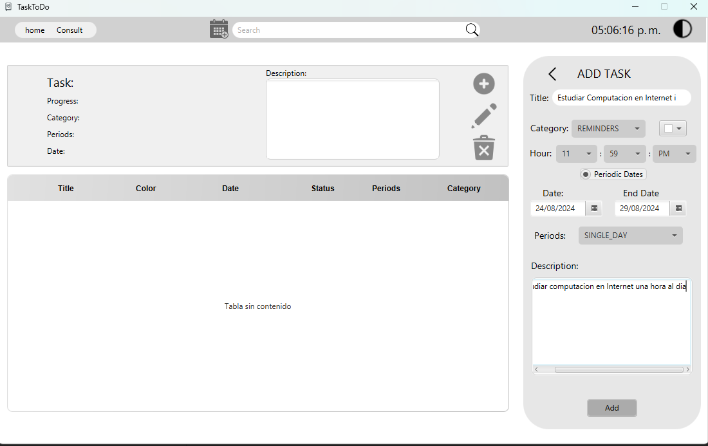
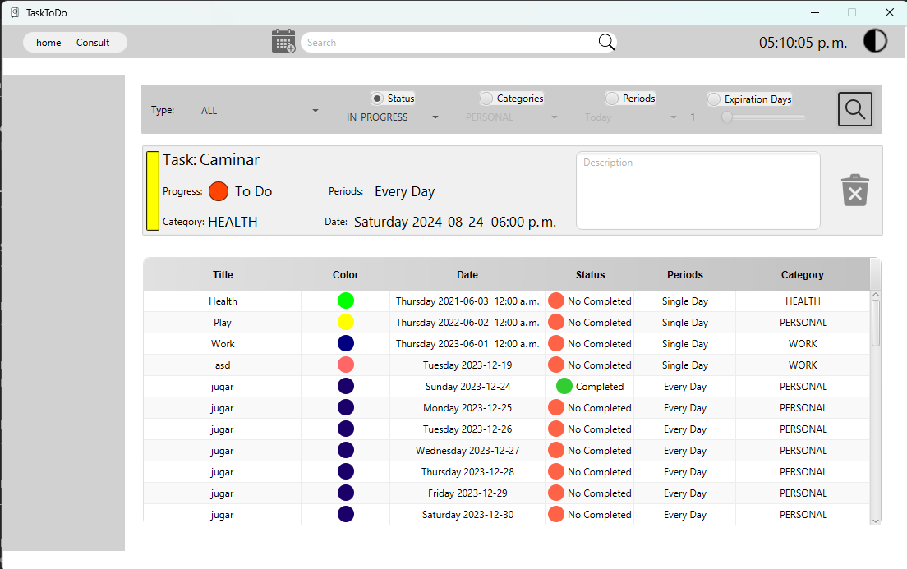
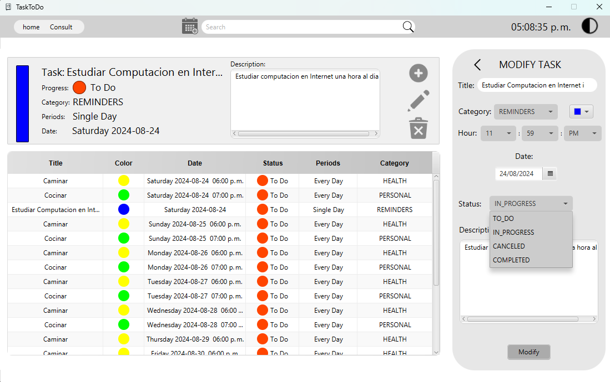

# CalendarDAOS

CalendarDAOS is a desktop application developed in JavaFX for managing tasks and reminders. It allows users to easily add, view, and edit tasks. The application features a customizable user interface with support for both light and dark modes, using CSS for visual styling and FXML for content and structure.

This project was created with the support of a tech camp by Perficient, where I enhanced my skills in database management and persistence.

## Features

- **Add Tasks:** Users can add new tasks by specifying the title, category, time, start and end date, periodicity, and description.
- **View Tasks:** The application provides a way to view registered tasks, organized by type, status, category, periods, and expiration days.
- **Edit Tasks:** Existing tasks can be edited, allowing changes to any attribute like status, category, or description.
- **Light and Dark Mode:** The application supports theme switching between light and dark modes for better user experience.
- **Customizable Interface:** The interface is styled using CSS, and FXML is used for structuring content, making the application easy to customize and adapt.
- **Database Persistence:** The application integrates database persistence, ensuring that all task data is saved and retrievable even after the application is closed.

## System Requirements

- Java SE 8 or higher
- JavaFX SDK
- An operating system compatible with Java (Windows, macOS, Linux)

## Installation

1. **Clone the repository:**

    ```bash
    git clone https://github.com/OscarMURA/CalendarDAOS
    ```

2. **Open the project in your favorite IDE:**

    You can use IntelliJ IDEA, Eclipse, NetBeans, or any other IDE compatible with JavaFX.

3. **Add JavaFX libraries:**

    If you haven't set up JavaFX in your project, follow the necessary steps to add the required libraries.

4. **Run the application:**

    Once the environment is set up, you can run the application directly from your IDE.

## Usage

1. **Add a Task:**
   - Select "Add Task" from the menu.
   - Fill in the required fields such as title, category, date, time, etc.
   - Click "Add" to save the task.




2. **View Tasks:**
   - Select "Consult" from the menu.
   - You can filter and organize tasks as needed.

3. **Edit a Task:**
   - Select the task you want to edit from the view.
   - Click "Edit Task" to modify the details.

4. **Switch Modes (Light/Dark):**
   - Use the theme toggle option to switch between light and dark modes based on your preference.


## Project Structure

- **src/**
  - Contains Java source files.
- **resources/**
  - Contains CSS and FXML files used for the user interface.
- **database/**
  - Contains scripts and configurations for database management and persistence.

## Contributing

If you wish to contribute to this project, please follow these steps:

1. Fork the project.
2. Create a new branch (`git checkout -b feature/new-feature`).
3. Make your changes and commit them (`git commit -am 'Add new feature'`).
4. Push to the branch (`git push origin feature/new-feature`).
5. Open a Pull Request.
